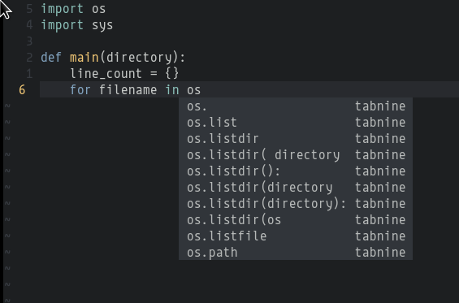

completion-tabnine
==================

A **TabNine** completion source for [completion-nvim](https://github.com/haorenW1025/completion-nvim)



### Install

- vim-plug
  ```
  Plug 'aca/completion-tabnine', { 'do': './install.sh' }
  ```

### Configuration
- vimrc
  ```
  " vimrc
  let g:completion_chain_complete_list = {
      \ 'default': [
      \    {'complete_items': ['lsp', 'snippet', 'tabnine' ]},
      \    {'mode': '<c-p>'},
      \    {'mode': '<c-n>'}
      \]
  \}
  ```
- options
  ```
  " max tabnine completion options(default 7)
  let g:completion_tabnine_max_num_results=7

  " sort by tabnine score (default 0)
  let g:completion_tabnine_sort_by_details=1

  " max line for tabnine input(default 1000)
  " from current line -1000 ~ +1000 lines is passed as input
  let g:completion_tabnine_max_lines=1000
  ```

### TODO
Any help would be greatly appreciated!

- [x] Scoring based on "TabNine score"
- [x] Configuration
- [x] Truncate string to avoid tabnine limit
- [ ] Vimdoc
- [ ] Error Handling
